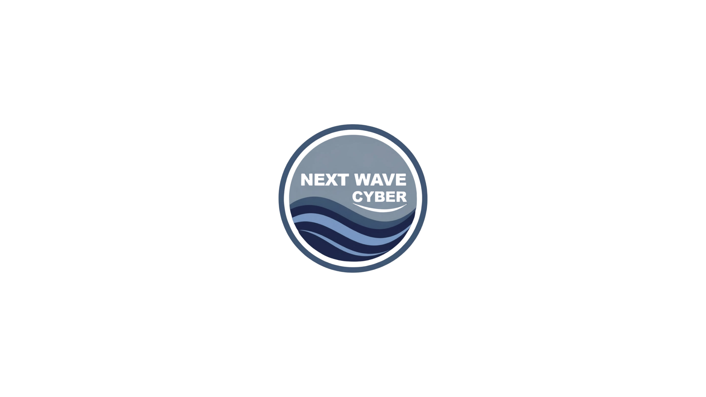

<p align="center">
  
</p>

<h1 align="center">AWS GRC Lab Series</h1>

<p align="center">
Building cloud security, compliance, and GRC engineering labs in AWS.
</p>

This repository accompanies the NextWaveCyber YouTube channel and follows the build-out of a secure AWS environment for a fictional company, Shoreline Solutions.

The goal of this series is to demonstrate how cloud infrastructure is built, secured, monitored, and aligned to security and compliance requirements

---

## Repository Structure

```
aws-grc-lab-series/
│── README.md                              # You are here
├── Labs/                                  # Step-by-step lab guides for each episode
│   ├── Lab01-infrastructure/             # Episode 1 — build the Shoreline Solutions AWS environment
│   │   └── aws-infrastructure-setup.md   # Full setup guide with every step and setting
│   └── Lab02 - Security/                 # Episode 2 — enable the security and compliance layer
│       └── shoreline-security-setup.md   # CloudTrail, GuardDuty, Config, and Security Hub setup
└── Assets/                               # Images and branding
    └── LogoNWC.png
```

---

## Labs

### Lab 01 — Infrastructure Setup
Build the Shoreline Solutions AWS environment from scratch: VPC, subnets, EC2 instances (web and app servers), Application Load Balancer, and RDS MySQL database.

**Guide:** [aws-infrastructure-setup.md](Labs/Lab01-infrastructure/aws-infrastructure-setup.md)

---

### Lab 02 — Security Services Setup
Enable the core security and compliance layer on top of the Lab 01 infrastructure. This lab activates CloudTrail, GuardDuty, AWS Config, and Security Hub with the NIST SP 800-53 Rev 5 standard, and routes all logs to a central S3 audit bucket.

**Services covered:** S3, CloudTrail, GuardDuty, AWS Config, Security Hub

**Guide:** [shoreline-security-setup.md](Labs/Lab02%20-%20Security/shoreline-security-setup.md)

